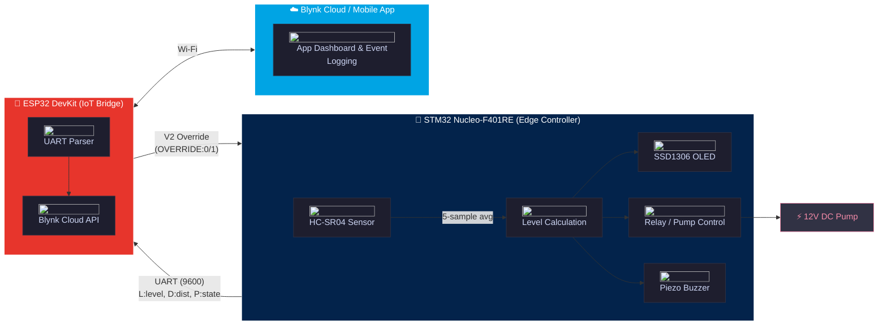
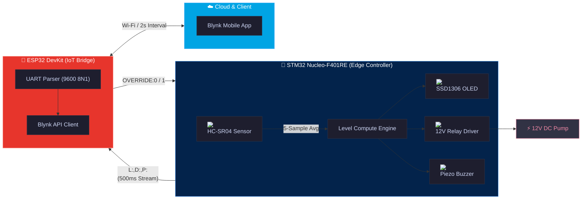

# Smart Water Level Monitoring & Automatic Pump Control System

<p align="center">


</p>

<p align="center">

</p>

---

## 📋 Contents

* [Project Overview](#project-overview)
* [Features](#features)
* [Technical Details](#technical-details) 
* [Installation](#installation)
* [Usage](#usage)
* [Results](#results)
* [Resources](#resources)
* [Contributing](#contributing)
* [License](#license)

---

<p align="center">
  <strong>Dual-core automated water tank monitor and edge-level pump controller.</strong><br>
  <em>Microprocessors & Computer Architecture (EFB 2073 / EEB 2083) • Universiti Teknologi PETRONAS</em>
</p>

<p align="center">
  <a href="#-overview">Overview</a> •
  <a href="#-prototype-gallery">Gallery</a> •
  <a href="#-system-architecture">Architecture</a> •
  <a href="#-pinout--schematic">Pinout & Schematic</a> •
  <a href="#-thresholds--calibration">Calibration</a> •
  <a href="#-quick-start">Quick Start</a> •
  <a href="#-test-results">Results</a> •
  <a href="#-documentation">Docs</a>
</p>

---

## 📖 Overview

An embedded water-tank monitoring and control prototype developed using an **STM32 Nucleo-F401RE** as the real-time controller and an **ESP32 DevKit** as the Wi-Fi/Blynk bridge. The system measures the distance between an HC-SR04 ultrasonic sensor and the water surface, converts the measurement into a calibrated water-level percentage, controls a 12 V pump through a relay module, displays live status on an SSD1306 OLED, produces buzzer alerts, and sends data to the Blynk IoT platform.

Developed as a comprehensive hardware-software portfolio project for **EFB 2073/EEB 2083 – Microprocessors & Computer Architecture** at **Universiti Teknologi PETRONAS** (January 2026 Semester).

> [!WARNING]
> **Hardware:** The HC-SR04 operates at 5V. The ECHO pin *must* be connected to the STM32 through a 5V-to-3.3V voltage divider (e.g., 1kΩ + 2kΩ) to prevent damaging the STM32 GPIO pins.

---

<details>
<summary>📸: <b> Full Hardware Assembly </b></summary>

<!-- 
Bulletproof HTML Table. 
Standard Markdown parsers often choke on raw HTML  tags inside native Markdown tables. 
Using a pure HTML <table> solves rendering issues on GitHub, GitLab, and local IDEs.
-->
<p align="center">
<a href="docs/hardware_photos/6235768536831824310_121.jpg" target="_blank">

</a>
</p>

</details>

---

<!-- 
Note on GitHub Behavior:
Wrapping the  in an <a> tag makes it fully clickable. 
When a user clicks it on GitHub, it will naturally open the full-resolution source image 
in a new browser tab ("pop") for close-up technical inspection.
-->
<table align="center" width="100%">
<tr>
<td align="center" width="33%">
<b>OLED Interface</b><br>

</td>
<td align="center" width="33%">
<b>Submersible Pump</b><br>

</td>
<td align="center" width="33%">
<b>Control Circuitry</b><br>

</td>
</tr>
</table>

---

## Features

- Five-sample ultrasonic distance averaging
- Calibrated water-level calculation
- Automatic relay/pump control
- Sensor-error safety shutdown
- Full and critical-low buzzer alerts
- Direct SSD1306 control using a custom 5×7 font renderer
- UART communication between STM32 and ESP32
- Blynk water-level, pump-state, distance, and Wi-Fi RSSI reporting
- Blynk event logging for low-water and full-tank conditions
- A V2 command that can force the pump relay ON through the implemented override logic

---

## Technical Details 

<details open>
<summary><strong> System Architecture Diagram </strong></summary>



</details>

<details>
<summary><strong> Pinout: STM32 Nucleo-F401RE </strong></summary>

<table width="100%" style="border-collapse: collapse; border: none;">
<!-- <tr> -->
<!-- Left Column: STM32 Pinout Table -->
<td width="50%" style="padding: 10px; vertical-align: top; border: none;">
<!-- <h4 style="margin-top: 0; color: #58a6ff;">📌 Pinout: STM32 Nucleo-F401RE</h4> -->
<table width="100%" style="border-collapse: collapse; font-size: 13px;">
<thead>
<tr style="background-color: #161b22;">
<th style="padding: 8px; border: 1px solid #30363d; text-align: center;">Pin</th>
<th style="padding: 8px; border: 1px solid #30363d; text-align: left;">Function</th>
<th style="padding: 8px; border: 1px solid #30363d; text-align: left;">Notes</th>
</tr>
</thead>
<tbody>
<tr>
<td style="padding: 8px; border: 1px solid #30363d; text-align: center;"><code>PA_0</code></td>
<td style="padding: 8px; border: 1px solid #30363d;">HC-SR04 Trigger</td>
<td style="padding: 8px; border: 1px solid #30363d;">3.3V logic output</td>
</tr>
<tr>
<td style="padding: 8px; border: 1px solid #30363d; text-align: center;"><code>PA_1</code></td>
<td style="padding: 8px; border: 1px solid #30363d;">HC-SR04 Echo</td>
<td style="padding: 8px; border: 1px solid #30363d;"><strong>Requires 5V → 3.3V divider</strong></td>
</tr>
<tr>
<td style="padding: 8px; border: 1px solid #30363d; text-align: center;"><code>PB_9</code></td>
<td style="padding: 8px; border: 1px solid #30363d;">OLED SDA</td>
<td style="padding: 8px; border: 1px solid #30363d;">I2C1</td>
</tr>
<tr>
<td style="padding: 8px; border: 1px solid #30363d; text-align: center;"><code>PB_8</code></td>
<td style="padding: 8px; border: 1px solid #30363d;">OLED SCL</td>
<td style="padding: 8px; border: 1px solid #30363d;">I2C1</td>
</tr>
<tr>
<td style="padding: 8px; border: 1px solid #30363d; text-align: center;"><code>D4</code></td>
<td style="padding: 8px; border: 1px solid #30363d;">OLED Reset</td>
<td style="padding: 8px; border: 1px solid #30363d;">GPIO</td>
</tr>
<tr>
<td style="padding: 8px; border: 1px solid #30363d; text-align: center;"><code>PA_6</code></td>
<td style="padding: 8px; border: 1px solid #30363d;">Buzzer Output</td>
<td style="padding: 8px; border: 1px solid #30363d;">PWM/Digital</td>
</tr>
<tr>
<td style="padding: 8px; border: 1px solid #30363d; text-align: center;"><code>PB_6</code></td>
<td style="padding: 8px; border: 1px solid #30363d;">Relay Control</td>
<td style="padding: 8px; border: 1px solid #30363d;">Active HIGH</td>
</tr>
<tr>
<td style="padding: 8px; border: 1px solid #30363d; text-align: center;"><code>PA_9</code></td>
<td style="padding: 8px; border: 1px solid #30363d;">UART TX</td>
<td style="padding: 8px; border: 1px solid #30363d;">To ESP32 GPIO16</td>
</tr>
<tr>
<td style="padding: 8px; border: 1px solid #30363d; text-align: center;"><code>PA_10</code></td>
<td style="padding: 8px; border: 1px solid #30363d;">UART RX</td>
<td style="padding: 8px; border: 1px solid #30363d;">From ESP32 GPIO17</td>
</tr>
</tbody>
</table>
</td>

<!-- Right Column: Circuit Schematic Card -->
<td width="50%" style="padding: 10px; vertical-align: top; border: none;">

</td>
</tr>
</table>

---

</details>


## 🏗 System Architecture 2

<details open>
<summary>📊 <b>Interactive Component & Telemetry Graph</b></summary>
<br>


---
</details>

## Pinout & Schematic

<table align="center" width="100%" style="border-collapse: collapse; border: none;">
  <tr>
    <!-- Left Column: Pinout Tables -->
    <td width="55%" valign="top" style="padding: 0 10px 0 0; border: none;">
      <details open>
        <summary><b>STM32 Nucleo-F401RE Pinout</b></summary>
        <br>
        <table width="100%" style="font-size: 13px;">
          <thead>
            <tr>
              <th align="center">Pin</th>
              <th align="left">Function</th>
              <th align="left">Hardware Target / Notes</th>
            </tr>
          </thead>
          <tbody>
            <tr><td align="center"><code>PA_0</code></td><td>HC-SR04 TRIG</td><td>10 µs trigger pulse output</td></tr>
            <tr><td align="center"><code>PA_1</code></td><td>HC-SR04 ECHO</td><td><strong>Via 1kΩ / 2kΩ divider (3.3V)</strong></td></tr>
            <tr><td align="center"><code>PB_9</code> / <code>PB_8</code></td><td>I2C1 SDA / SCL</td><td>SSD1306 OLED (Addr: <code>0x3C</code>, 100 kHz)</td></tr>
            <tr><td align="center"><code>D4</code></td><td>OLED RST</td><td>Hardware display reset</td></tr>
            <tr><td align="center"><code>PA_6</code></td><td>Buzzer</td><td>Active HIGH alarm driver</td></tr>
            <tr><td align="center"><code>PB_6</code></td><td>Relay Signal</td><td>Active HIGH relay trigger (Avoids PA_7 conflict)</td></tr>
            <tr><td align="center"><code>PA_9</code></td><td>UART TX</td><td>To ESP32 <code>GPIO16</code> (9600 baud)</td></tr>
            <tr><td align="center"><code>PA_10</code></td><td>UART RX</td><td>From ESP32 <code>GPIO17</code></td></tr>
          </tbody>
        </table>
      </details>
      <br>
      <details open>
        <summary><b>ESP32 DevKit Pinout</b></summary>
        <br>
        <table width="100%" style="font-size: 13px;">
          <thead>
            <tr>
              <th align="center">Pin</th>
              <th align="left">Function</th>
              <th align="left">Hardware Target / Notes</th>
            </tr>
          </thead>
          <tbody>
            <tr><td align="center"><code>GPIO16</code></td><td>UART2 RX</td><td>Connected to STM32 <code>PA_9</code> (TX)</td></tr>
            <tr><td align="center"><code>GPIO17</code></td><td>UART2 TX</td><td>Connected to STM32 <code>PA_10</code> (RX)</td></tr>
            <tr><td align="center"><code>GND</code></td><td>Common GND</td><td><strong>Mandatory common ground reference</strong></td></tr>
          </tbody>
        </table>
      </details>
    </td>
    <!-- Right Column: Circuit Schematic Card -->
    <td width="45%" valign="top" style="padding: 0 0 0 10px; border: none;">
      <div style="background: #0d1117; border: 1px solid #30363d; border-radius: 8px; padding: 12px; text-align: center;">
        <strong style="color: #58a6ff; font-size: 13px; display: block; margin-bottom: 8px;">⚡ Wiring & Power Schematic</strong>
        <a href="docs/diagrams/Circuit%20Diagram.jpg" target="_blank">
          
        </a>
        <p style="color: #8b949e; font-size: 11px; margin: 8px 0 0 0; line-height: 1.3;">
          Dual power routing: 11.1V raw battery loop for the 12V pump relay; buck-regulated 5V bus powering logic.
        </p>
      </div>
    </td>
  </tr>
</table>

---

## ⚙️ Thresholds & Calibration

The system uses linear interpolation between physical empty/full distances with a 5-sample noise-rejection filter:

$$\text{Level \%} = \frac{\text{Empty Distance} - \text{Measured Distance}}{\text{Empty Distance} - \text{Full Distance}} \times 100$$

| Parameter | Calibrated Value | Operational Logic |
| :--- | :---: | :--- |
| **Empty Tank Reference** | `18.5 cm` | Calibrated container baseline (maps to 0%) |
| **Full Tank Reference** | `3.0 cm` | Minimum safe container limit (maps to 100%) |
| **Pump Threshold** | `< 90%` ON / `≥ 90%` OFF | Automatic filling cutoff boundary |
| **Critical Low Alarm** | `≤ 10%` | Latched 2s buzzer beep + `critical_low` Blynk push notification |
| **Full Tank Alarm** | `≥ 95%` | Latched 2s buzzer beep + `tank_full` Blynk push notification |
| **Sensor Fault Safeguard** | Invalid / Timeout | Automatic relay deactivation + OLED error banner |

---

## 🚀 Quick Start

### 1. STM32 Edge Controller (Keil Studio Cloud / Mbed 2)
1. Open [Keil Studio Cloud](https://studio.keil.arm.com) and create a project with the **ARM Mbed 2** (`mbed.h`) template.
2. Copy [`stm32_firmware/main.cpp`](./stm32_firmware/main.cpp) into your project root[cite: 14].
3. Select `NUCLEO-F401RE` as the target, compile, and flash via USB drag-and-drop[cite: 14].

### 2. ESP32 IoT Bridge (Arduino IDE)
1. Open [`esp32_firmware/esp32_blynk.ino`](./esp32_firmware/esp32_blynk.ino) in Arduino IDE[cite: 14].
2. Configure credentials in the header definitions:
   ```cpp
   #define BLYNK_TEMPLATE_ID   "YOUR_TEMPLATE_ID"
   #define BLYNK_TEMPLATE_NAME "Water Monitor"
   #define BLYNK_AUTH_TOKEN    "YOUR_AUTH_TOKEN"
   #define WIFI_SSID           "YOUR_2.4GHZ_WIFI"
   #define WIFI_PASS           "YOUR_PASSWORD"


<details>
<summary><strong> Bill of Materials (BOM) </strong></summary>

| Component | Model |
|---|---|
| Main controller | STM32 Nucleo-F401RE |
| IoT bridge | ESP32 DevKit with CP2102 USB interface |
| Distance sensor | HC-SR04 ultrasonic sensor |
| Display | SSD1306 OLED, 128×32, I2C, address 0x3C |
| Relay module | 12 V relay module used to switch the pump |
| Pump | 12 V DC submersible pump |
| Alert device | Piezo buzzer |
| Main load supply | Three 18650 cells in series, approximately 11.1 V nominal and 12.6 V fully charged |

See [`docs/CONNECTIONS.md`](docs/CONNECTIONS.md) for the full wiring table and electrical cautions.

</details>


<details>
<summary><strong> Pinout: STM32 Nucleo-F401RE </strong></summary>

| Pin | Function | Notes |
|:---:|:---|:---|
| `PA_0` | HC-SR04 Trigger | 3.3V logic output |
| `PA_1` | HC-SR04 Echo | **Requires 5V→3.3V voltage divider** |
| `PB_9` | OLED SDA | I2C1 |
| `PB_8` | OLED SCL | I2C1 |
| `D4` | OLED Reset | GPIO |
| `PA_6` | Buzzer Output | PWM/Digital |
| `PB_6` | Relay Control | Active HIGH |
| `PA_9` | UART TX | To ESP32 GPIO16 |
| `PA_10`| UART RX | From ESP32 GPIO17 |

</details>

<details>
<summary><strong> Pinout: ESP32 DevKit </strong></summary>


| Pin | Function | Notes |
|:---:|:---|:---|
| `GPIO16` | UART2 RX | From STM32 PA_9 |
| `GPIO17` | UART2 TX | To STM32 PA_10 |
| `GND` | Signal Ground | **Must be shared with STM32** |

</details>

<details>
<summary><strong> Implemented Thresholds </strong></summary>

| Parameter | Code Value |
| :--- | :--- |
| **Empty-tank distance** | `18.5 cm` |
| **Full-tank distance** | `3.0 cm` |
| **Pump ON threshold** | `< 90%` |
| **Pump OFF threshold** | `≥ 90%` |
| **Critical-low alert** | `≤ 10%` (Triggers Buzzer + Blynk Event) |
| **Full alert** | `≥ 95%` (Triggers Buzzer + Blynk Event) |
| **UART Baud Rate** | `9600` |
| **Blynk Update Interval** | `2.0 s` |
| **STM32 timeout on ESP32** | `10 s` |

</details>

---

## Installation

### 1. STM32 Edge Firmware (Keil Studio Cloud)
1. Open your workspace on [Keil Studio Cloud](https://studio.keil.arm.com).
2. Initialize an empty project utilizing the classic **ARM Mbed 2** core template (`mbed.h`).
3. Import the source code from [`stm32_firmware/main.cpp`](./stm32_firmware/main.cpp).
4. Set the target build system to `NUCLEO-F401RE`, compile, and flash the device.

```text
L:<level>,D:<distance>,P:<pump_state>
```

### 2. ESP32 IoT Firmware (Arduino IDE)
1. Launch **Arduino IDE** and ensure the ESP32 board support package and **Blynk library** are installed.
2. Open [`esp32_firmware/esp32_blynk.ino`](./esp32_firmware/esp32_blynk.ino).
3. Populate your specific network credentials and authentication tokens:
   ```cpp
   #define BLYNK_TEMPLATE_ID   "YOUR_TEMPLATE_ID"
   #define BLYNK_TEMPLATE_NAME "YOUR_TEMPLATE_NAME"
   #define BLYNK_AUTH_TOKEN    "YOUR_AUTH_TOKEN"
   #define WIFI_SSID           "YOUR_WIFI_SSID"
   #define WIFI_PASS           "YOUR_WIFI_PASSWORD"
   ```
   4. Compile and upload directly to your ESP32 board.

> [!TIP]
> Open the Serial Monitor at **115200 baud** to verify the ESP32 is successfully parsing UART data and connecting to Blynk.

---

## Blynk Configuration

Create these datastreams:

| Virtual pin | Data | Suggested type/range |
|---|---|---|
| V0 | Water level | Double, 0–100 |
| V1 | Pump state | Integer, 0–1 |
| V2 | Override command | Integer, 0–1 |
| V3 | Distance | Double, 0–400 |
| V4 | Wi-Fi RSSI | Integer, approximately -100 to 0 |

Create the following events:

```text
critical_low
tank_full
```

Detailed setup is available in [`docs/BLYNK_SETUP.md`](docs/BLYNK_SETUP.md).

## Testing 

The documented test container used:

- Empty distance: 18.5 cm
- Half-level distance: approximately 10.8 cm
- Full distance: approximately 3.0 cm

| Condition | Expected displayed level | Pump | Buzzer |
|---|---:|---|---|
| Empty | 0% | ON | Silent initially unless the low threshold is crossed |
| Half | Approximately 50% | ON | Silent |
| Full | 100% | OFF | 2-second alert |
| Critical low | Approximately 10% | ON | 2-second alert |

The project notes report approximately ±1 cm ultrasonic consistency after five-sample averaging and a Blynk update delay of roughly 2–3 seconds.

## Known Implementation Details

- The STM32 code includes manual-override handling even though the development notes state that the feature was not required in the final demonstration.
- In the implemented STM32 logic, `OVERRIDE:1` forces the relay ON. `OVERRIDE:0` returns control to the automatic threshold logic.
- The ESP32 code can call Blynk event logging repeatedly every two seconds while an alert condition remains true; no event latch is implemented in that sketch.
- The STM32 source retains a global `DigitalOut esp_tx(PA_9)` declaration and also creates `Serial espUart(PA_9, PA_10)` inside `main()`. This repository leaves that source unchanged.
- The relay logic assumes that a logic HIGH activates the selected relay module.
- Common ground is mandatory for UART and relay-control reference levels.

## Future Improvements

- Add relay hysteresis by separating pump-ON and pump-OFF thresholds
- Add event latching or cooldown for Blynk notifications
- Add a water-flow sensor
- Add redundant level sensing
- Add pump dry-run and overcurrent protection
- Add low-battery monitoring
- Add SMS or cellular fallback
- Add solar charging
- Support multiple tanks
- Move credentials into a private configuration file

## License

Released under the [MIT License](./LICENSE).

---
