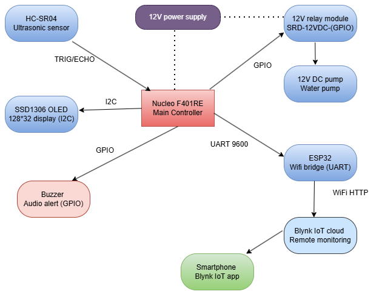
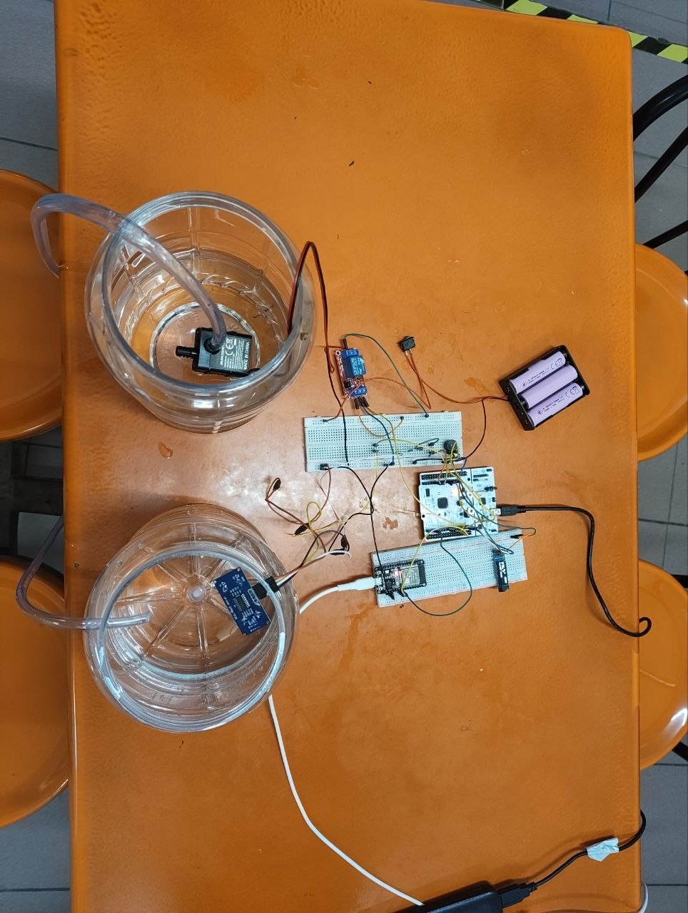
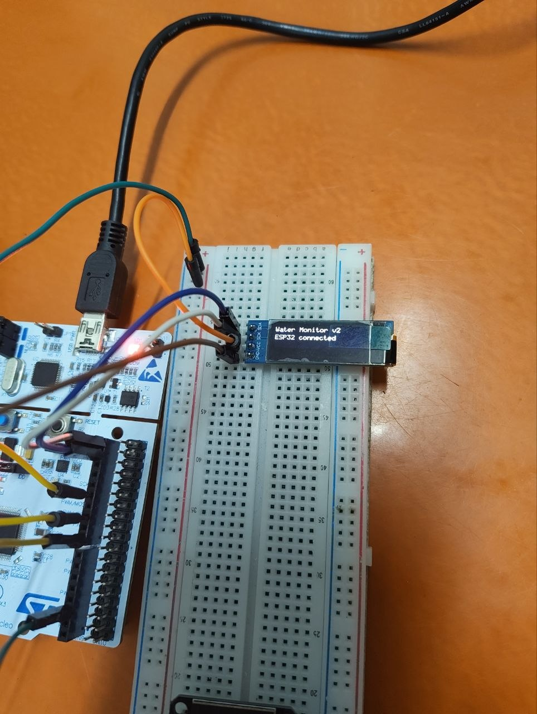
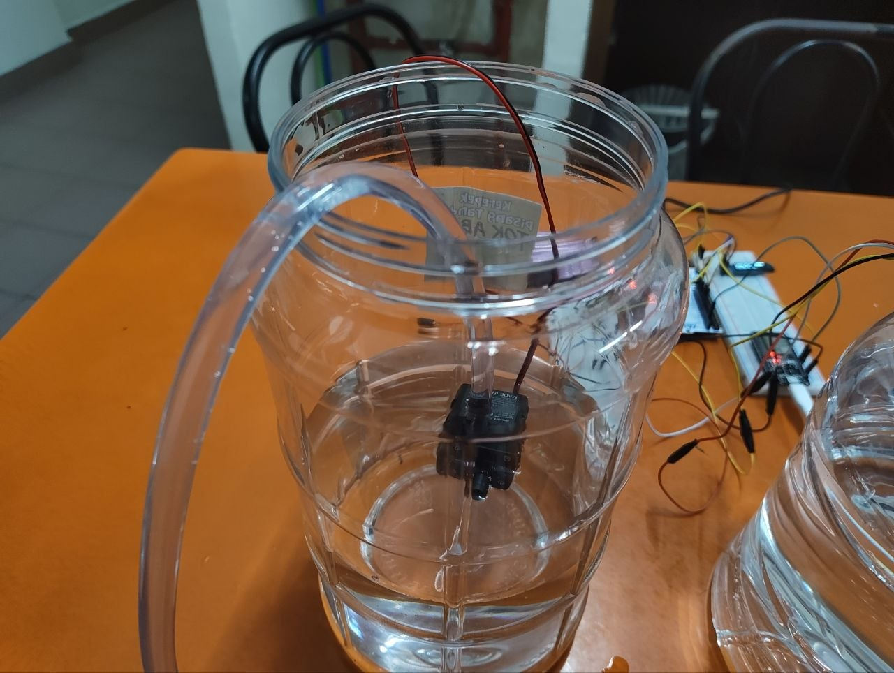
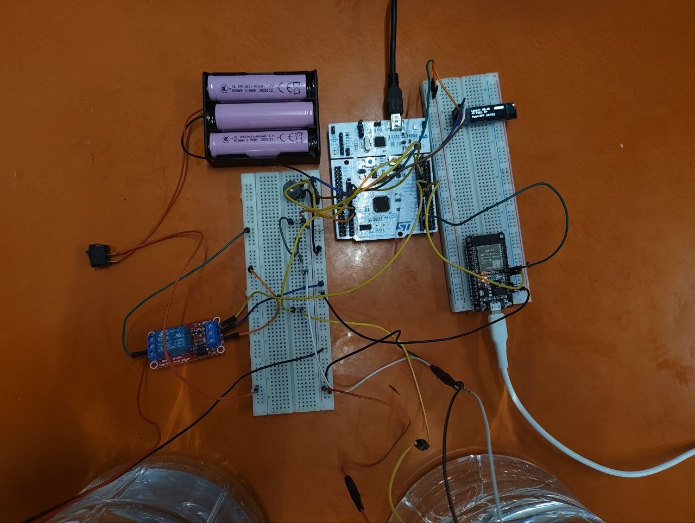
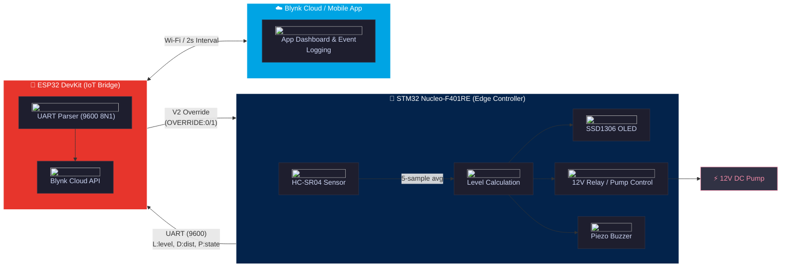

# Smart Water Level Monitoring & Automatic Pump Control System

<p align="center">


</p>

<p align="center">

</p>

---

## 📋 Contents

* [Project Overview](#project-overview)
* [Features](#features)
* [Technical Details](#technical-details) 
* [Installation](#installation)
* [Usage](#usage)
* [Results](#results)
* [Resources](#resources)
* [Contributing](#contributing)
* [License](#license)

---

<p align="center">
  <strong>Dual-core automated water tank monitor and edge-level pump controller.</strong><br>
  <em>Microprocessors & Computer Architecture (EFB 2073 / EEB 2083) • Universiti Teknologi PETRONAS</em>
</p>

<p align="center">
  <a href="#overview">Overview</a> •
  <a href="#prototype-gallery">Gallery</a> •
  <a href="#system-architecture">Architecture</a> •
  <a href="#pinout--schematic">Pinout & Schematic</a> •
  <a href="#thresholds--calibration">Calibration</a> •
  <a href="#installation">Installation</a> •
  <a href="#results">Results</a> •
  <a href="#documentation">Docs</a>
</p>

---

## 📖 Overview

An embedded water-tank monitoring and control prototype developed using an **STM32 Nucleo-F401RE** as the real-time controller and an **ESP32 DevKit** as the Wi-Fi/Blynk bridge. The system measures the distance between an HC-SR04 ultrasonic sensor and the water surface, converts the measurement into a calibrated water-level percentage, controls a 12 V pump through a relay module, displays live status on an SSD1306 OLED, produces buzzer alerts, and sends data to the Blynk IoT platform.

Developed as a comprehensive hardware-software portfolio project for **EFB 2073/EEB 2083 – Microprocessors & Computer Architecture** at **Universiti Teknologi PETRONAS** (January 2026 Semester).

> [!WARNING]
> **Hardware:** The HC-SR04 operates at 5V. The ECHO pin *must* be connected to the STM32 through a 5V-to-3.3V voltage divider (e.g., 1kΩ + 2kΩ) to prevent damaging the STM32 GPIO pins.

---

<table align="center" width="100%" style="border-collapse: collapse; border: none;">
  <!-- Row 1 -->
  <tr>
    <td width="50%" align="center" valign="middle" style="padding: 4px; border: none;">
      <div align="center"><b>Full Hardware Assembly</b></div>
      <a href="docs/hardware_photos/6235768536831824310_121.jpg" target="_blank" style="display: block; margin-top: 4px;">
        
      </a>
    </td>
    <td width="50%" align="center" valign="middle" style="padding: 4px; border: none;">
      <div align="center"><b>Local OLED Interface</b></div>
      <a href="docs/hardware_photos/6248794734553927220_121.jpg" target="_blank" style="display: block; margin-top: 4px;">
        
      </a>
    </td>
  </tr>
  <!-- Row 2 -->
  <tr>
    <td width="50%" align="center" valign="middle" style="padding: 4px; border: none;">
      <div align="center"><b>Submersible Pump</b></div>
      <a href="docs/hardware_photos/6248794734553927232_121.jpg" target="_blank" style="display: block; margin-top: 4px;">
        
      </a>
    </td>
    <td width="50%" align="center" valign="middle" style="padding: 4px; border: none;">
      <div align="center"><b>Control Circuitry</b></div>
      <a href="docs/hardware_photos/6248794734553927236_121.jpg" target="_blank" style="display: block; margin-top: 4px;">
        
      </a>
    </td>
  </tr>
</table>

---

## Features

- Five-sample ultrasonic distance averaging
- Calibrated water-level calculation
- Automatic relay/pump control
- Sensor-error safety shutdown
- Full and critical-low buzzer alerts
- Direct SSD1306 control using a custom 5×7 font renderer
- UART communication between STM32 and ESP32
- Blynk water-level, pump-state, distance, and Wi-Fi RSSI reporting
- Blynk event logging for low-water and full-tank conditions
- A V2 command that can force the pump relay ON through the implemented override logic

---

## Technical Details 

<details open>
<summary><strong> System Architecture Diagram </strong></summary>



</details>

---

## Pinout & Schematic

<table align="left" width="100%" style="border-collapse: collapse; border: none;">
  <tr>
    <!-- Left Column: 2-Column Pinout Tables -->
    <td width="42%" valign="top" style="padding: 0 10px 0 0; border: none;">
      <details open>
        <summary><b>STM32 Nucleo-F401RE Pinout</b></summary>
        <br>
        <table width="100%" style="font-size: 11px; border-collapse: collapse;">
          <thead>
            <tr>
              <th align="left" style="width: 28%;">Pin</th>
              <th align="left">Interface & Hardware Target</th>
            </tr>
          </thead>
          <tbody>
            <tr><td><code>PA_0</code></td><td>HC-SR04 TRIG (10 µs pulse)</td></tr>
            <tr><td><code>PA_1</code></td><td>HC-SR04 ECHO <strong>(via 5V→3.3V divider)</strong></td></tr>
            <tr><td><code>PB_9/8</code></td><td>SSD1306 OLED (I2C1 SDA / SCL)</td></tr>
            <tr><td><code>D4</code></td><td>SSD1306 OLED Reset (RST)</td></tr>
            <tr><td><code>PA_6</code></td><td>Piezo Buzzer (Active HIGH)</td></tr>
            <tr><td><code>PB_6</code></td><td>12V Relay Trigger (Active HIGH)</td></tr>
            <tr><td><code>PA_9</code></td><td>UART TX ➔ ESP32 GPIO16 (9600 baud)</td></tr>
            <tr><td><code>PA_10</code></td><td>UART RX 🠔 ESP32 GPIO17</td></tr>
          </tbody>
        </table>
      </details>
      <br>
      <details open>
        <summary><b>ESP32 DevKit Pinout</b></summary>
        <br>
        <table width="100%" style="font-size: 11px; border-collapse: collapse;">
          <thead>
            <tr>
              <th align="left" style="width: 28%;">Pin</th>
              <th align="left">Interface & Hardware Target</th>
            </tr>
          </thead>
          <tbody>
            <tr><td><code>GPIO16</code></td><td>UART2 RX 🠔 STM32 PA_9</td></tr>
            <tr><td><code>GPIO17</code></td><td>UART2 TX ➔ STM32 PA_10</td></tr>
            <tr><td><code>GND</code></td><td><strong>Common Ground Reference</strong></td></tr>
          </tbody>
        </table>
      </details>
    </td>
    <!-- Right Column: Circuit Schematic Card -->
    <td width="58%" valign="top" style="padding: 0 0 0 10px; border: none;">
      <div style="background: #0d1117; border: 1px solid #30363d; border-radius: 8px; padding: 14px; text-align: center;">
        <strong style="color: #58a6ff; font-size: 13px; display: block; margin-bottom: 8px;">Wiring & Power Schematic</strong>
        <a href="docs/diagrams/Circuit%20Diagram.jpg" target="_blank">
          
        </a>
        <p style="color: #8b949e; font-size: 11px; margin: 8px 0 0 0; line-height: 1.3;">
          Dual power routing: 11.1V raw battery loop for the 12V pump relay; buck-regulated 5V bus powering logic.
        </p>
      </div>
    </td>
  </tr>
</table>

---

## Thresholds & Calibration

The system uses linear interpolation between physical empty/full distances with a 5-sample noise-rejection filter:

$$\text{Level \%} = \frac{\text{Empty Distance} - \text{Measured Distance}}{\text{Empty Distance} - \text{Full Distance}} \times 100$$

| Parameter | Calibrated Value | Operational Logic |
| :--- | :---: | :--- |
| **Empty Tank Reference** | `18.5 cm` | Calibrated container baseline (maps to 0%) |
| **Full Tank Reference** | `3.0 cm` | Minimum safe container limit (maps to 100%) |
| **Pump Threshold** | `< 90%` ON / `≥ 90%` OFF | Automatic filling cutoff boundary |
| **Critical Low Alarm** | `≤ 10%` | Latched 2s buzzer beep + `critical_low` Blynk push notification |
| **Full Tank Alarm** | `≥ 95%` | Latched 2s buzzer beep + `tank_full` Blynk push notification |
| **Sensor Fault Safeguard** | Invalid / Timeout | Automatic relay deactivation + OLED error banner |

---

## Installation

### 1. STM32 Edge Controller (Keil Studio Cloud / Mbed 2)
1. Open [Keil Studio Cloud](https://studio.keil.arm.com) and create a project with the **ARM Mbed 2** (`mbed.h`) template.
2. Copy [`stm32_firmware/main.cpp`](./stm32_firmware/main.cpp) into your project root.
3. Select `NUCLEO-F401RE` as the target, compile, and flash via USB drag-and-drop.

### 2. ESP32 IoT Bridge (Arduino IDE)
1. Open [`esp32_firmware/esp32_blynk.ino`](./esp32_firmware/esp32_blynk.ino) in Arduino IDE.
2. Configure credentials in the header definitions:
```cpp
#define BLYNK_TEMPLATE_ID   "YOUR_TEMPLATE_ID"
#define BLYNK_TEMPLATE_NAME "Water Monitor"
#define BLYNK_AUTH_TOKEN    "YOUR_AUTH_TOKEN"
#define WIFI_SSID           "YOUR_2.4GHZ_WIFI"
#define WIFI_PASS           "YOUR_PASSWORD"
```

> [!TIP]
> Open the Serial Monitor at **115200 baud** to verify the ESP32 is successfully parsing UART data and connecting to Blynk.

---

<details>
<summary><strong> Bill of Materials (BOM) </strong></summary>

| Component | Model |
|---|---|
| Main controller | STM32 Nucleo-F401RE |
| IoT bridge | ESP32 DevKit with CP2102 USB interface |
| Distance sensor | HC-SR04 ultrasonic sensor |
| Display | SSD1306 OLED, 128×32, I2C, address 0x3C |
| Relay module | 12 V relay module used to switch the pump |
| Pump | 12 V DC submersible pump |
| Alert device | Piezo buzzer |
| Main load supply | Three 18650 cells in series, approximately 11.1 V nominal and 12.6 V fully charged |

See [`docs/CONNECTIONS.md`](docs/CONNECTIONS.md) for the full wiring table and electrical cautions.
</details>

---

## Blynk Configuration

Create these datastreams:

| Virtual pin | Data | Suggested type/range |
|---|---|---|
| V0 | Water level | Double, 0–100 |
| V1 | Pump state | Integer, 0–1 |
| V2 | Override command | Integer, 0–1 |
| V3 | Distance | Double, 0–400 |
| V4 | Wi-Fi RSSI | Integer, approximately -100 to 0 |

Create the following events:

```text
critical_low
tank_full
```

Detailed setup is available in [`docs/BLYNK_SETUP.md`](docs/BLYNK_SETUP.md).

## Testing 

The documented test container used:

- Empty distance: 18.5 cm
- Half-level distance: approximately 10.8 cm
- Full distance: approximately 3.0 cm

| Condition | Expected displayed level | Pump | Buzzer |
|---|---:|---|---|
| Empty | 0% | ON | Silent initially unless the low threshold is crossed |
| Half | Approximately 50% | ON | Silent |
| Full | 100% | OFF | 2-second alert |
| Critical low | Approximately 10% | ON | 2-second alert |

The project notes report approximately ±1 cm ultrasonic consistency after five-sample averaging and a Blynk update delay of roughly 2–3 seconds.

## Future Improvements

- Add relay hysteresis by separating pump-ON and pump-OFF thresholds
- Add event latching or cooldown for Blynk notifications
- Add a water-flow sensor
- Add redundant level sensing
- Add pump dry-run and overcurrent protection
- Add low-battery monitoring
- Add SMS or cellular fallback
- Add solar charging
- Support multiple tanks
- Move credentials into a private configuration file

## License

Released under the [MIT License](./LICENSE).

---
